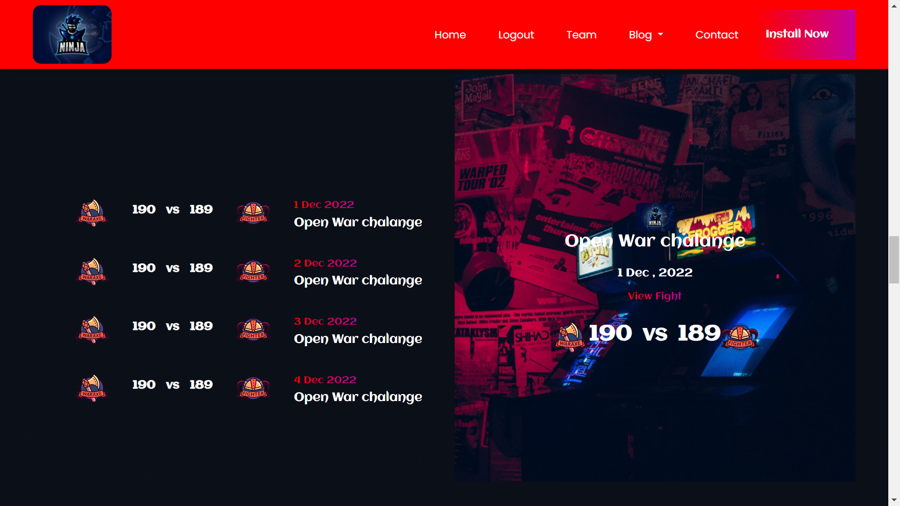
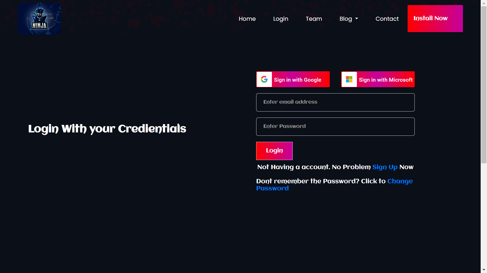
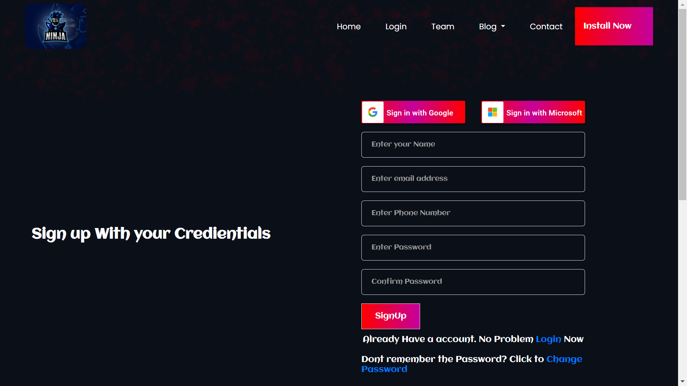
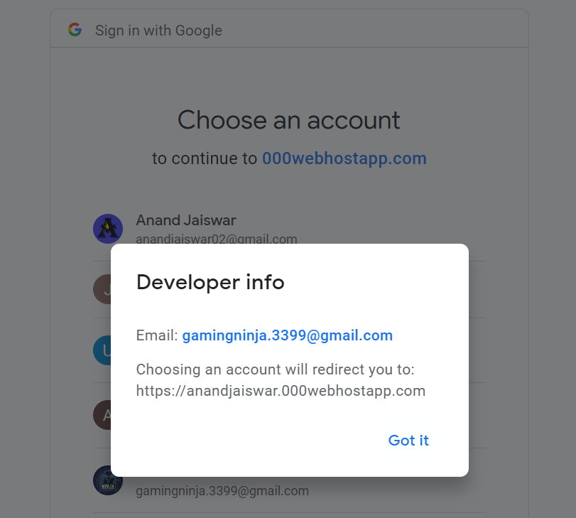
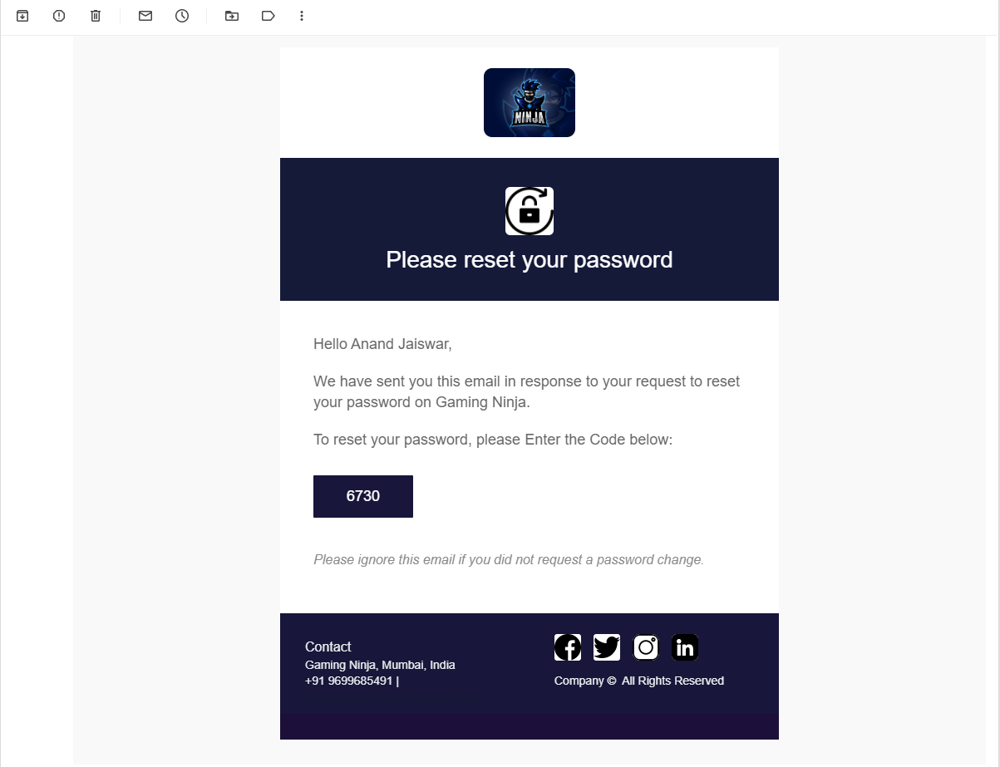

# Gaming-Ninja

I aim to make a complete website that should have all the essential parts a website should have.

[https://anandjaiswar.000webhostapp.com/Projects/GamingNinja/](https://anandjaiswar.000webhostapp.com/Projects/GamingNinja)

Features

1. Easy and effective UI for users
2. [Register](https://anandjaiswar.000webhostapp.com/Projects/GamingNinja/signup.php) with Email (Password Encrypted)
3. [Sign in ](https://anandjaiswar.000webhostapp.com/Projects/GamingNinja/login.php)with Email (Password Encrypted)
4. [Forgot password](https://anandjaiswar.000webhostapp.com/Projects/GamingNinja/forgot main.php) if the password is not remembered. (Unique Login Code every time is mailed to the user). The Login Code is valid for the current session of the user(No one and even Admins cannot use the Unique Login code).
5. Sign in with the Google button enabled. Users can sign in with Google. [Check the button on [Log In Page](https://anandjaiswar.000webhostapp.com/Projects/GamingNinja/login.php) or [Registration Page](https://anandjaiswar.000webhostapp.com/Projects/GamingNinja/signup.php)]
6. [Admin](https://anandjaiswar.000webhostapp.com/Projects/GamingNinja/SuperUser.php) console which can see the no. of users Registered and rated to the website. This Admin console only the admin can see.
7. The passwords that you enter are encrypted [2 & 3] using password_hash() with PASSWORD_BCRYPT. It uses the CRYPT_BLOWFISH algorithm to create the hash. This will produce a standard crypt() compatible hash using the "$2y$" identifier. The result will always be a 60-character string or false on failure.

released on 2-8-2023

Tools/Technologies Used in this Project

* FrontEnd - HTML, CSS, JavaScript
* BackEnd - PHP - v8.0.7
* PHP resolver is 000webhostapp
* Database -000webhostapp inbuilt database (Passwords are encrypted and no Malware Guaranteed)
* Mailing System - PHP Mailer (Mailed with my Private Gmail Account)
* Sign In With Google (GOOGLE API CLIENT SERVICE - OAUTH2)

and even more ........

## Screenshots of the website

